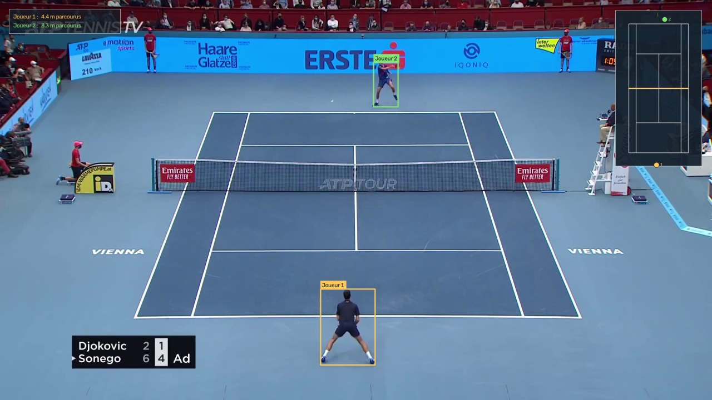
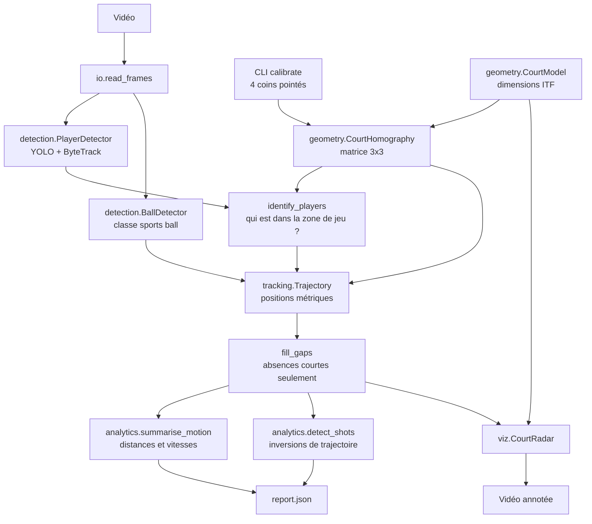
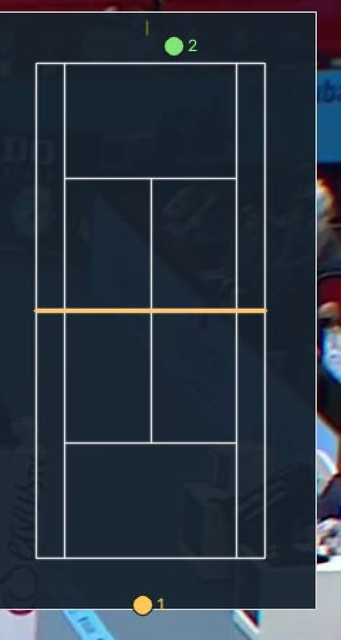

# TennisVision

Analyse vidéo de matchs de tennis. À partir d'une retransmission ordinaire, le pipeline détecte
les joueurs et la balle, puis produit des statistiques en **coordonnées métriques réelles** :
distance parcourue, vitesses de déplacement, vitesse de balle, coups échangés.



---

## Overview

### Le problème

Une vidéo de match contient une information riche, mais enfermée dans des pixels. Un détecteur
d'objets sait dire *« il y a une personne à cet endroit de l'image »*. Cela ne répond pas aux
questions qui intéressent un entraîneur : combien ce joueur a-t-il couru, à quelle vitesse se
déplace-t-il, combien de coups ont été échangés.

Passer des pixels aux mètres suppose de corriger la **perspective**. Une caméra placée en hauteur
derrière le court écrase le fond de la scène. Sur la vidéo d'exemple, la largeur du court occupe
**767 pixels au fond** contre **1 232 pixels au premier plan** — pour exactement la même distance
réelle de 10,97 m. Mesurer un déplacement directement en pixels donne donc un résultat faux, et
faux différemment selon l'endroit du court.

### L'approche

Une caméra qui filme un **plan** induit une transformation projective entre le plan image et ce
plan réel, entièrement décrite par une matrice 3×3 dite d'**homographie**. Elle possède 8 degrés
de liberté — la matrice a 9 coefficients mais elle est définie à un facteur d'échelle près — et
chaque correspondance de points fournit 2 équations : **4 points suffisent** à la déterminer.

Le court de tennis est justement un plan aux dimensions réglementaires connues : 10,97 m sur
23,77 m en double. Repérer ses 4 coins une seule fois suffit donc à projeter n'importe quel pixel
du sol en position métrique exacte.

```python
# tennisvision/geometry/homography.py
vector = np.array([x, y, 1.0])       # coordonnées homogènes
projected = matrix @ vector
across, along = projected[0] / projected[2], projected[1] / projected[2]
```

La division par la troisième composante est ce qui encode la perspective. Sans elle, la
transformation serait affine et ne pourrait pas rendre compte du rétrécissement des objets
éloignés.

> **Conséquence pratique.** Un joueur est projeté par le **milieu du bord inférieur de sa boîte
> englobante** — ses pieds. L'homographie n'est valide que pour les points appartenant au plan du
> sol ; projeter le centre de la boîte, situé à hauteur de torse, introduirait une erreur
> systématique croissant avec l'éloignement à la caméra.

---

## Features

- **Suivi des joueurs** — YOLO et ByteTrack, avec identité persistante d'une frame à l'autre
- **Identification géométrique des joueurs** — spectateurs, ramasseurs et arbitre écartés par test d'appartenance au court, en mètres
- **Détection de la balle** — seuil de confiance bas, sélection de la détection la plus sûre par frame
- **Comblement borné des absences** — les trous courts sont interpolés, les longs restent ouverts
- **Statistiques** — distance parcourue, vitesses moyenne et maximale, vitesse de balle, coups
- **Radar vue du dessus** — positions réelles reportées sur un court à l'échelle, avec traînée de balle
- **Vidéo annotée** et **rapport JSON**
- **Cache des détections** — indexé sur le modèle et le seuil, donc invalidé automatiquement quand la configuration change

---

## Architecture



### Les décisions de conception

**Le modèle de court porte sa propre géométrie.** `CourtModel.markings()` décrit chaque trait du
marquage en mètres. Ce même modèle sert de cible à l'homographie *et* de source au dessin du
radar, si bien qu'aucune coordonnée de pixel n'est écrite en dur : corriger une dimension
réglementaire met à jour la projection et le rendu d'un seul coup.

**`Trajectory` est l'abstraction centrale.** Plutôt que de faire circuler des listes parallèles de
positions, d'indices et de vitesses, une trajectoire encapsule la série temporelle et définit une
fois pour toutes le pas d'échantillonnage et le comblement des trous. Les analyses n'ont plus qu'à
la parcourir.

**Les types sont explicites.** Une `BoundingBox` sait calculer son propre point d'appui au sol,
au lieu de laisser chaque module qui en a besoin redécouvrir cette règle géométrique.

**Le pipeline ne contient aucune logique métier.** Il enchaîne des composants. Toute la géométrie
est dans `geometry`, toute la cinématique dans `analytics` — ce qui permet de tester les calculs
sans jamais lancer une détection.

---

## Tech Stack

| Technologie | Rôle |
|---|---|
| **Python 3.10+** | langage |
| **Ultralytics YOLO** | détection des joueurs (`person`) et de la balle (`sports ball`), suivi ByteTrack |
| **PyTorch** | backend d'inférence |
| **OpenCV** | estimation de l'homographie, lecture/écriture vidéo, rendu |
| **NumPy** | algèbre linéaire, coordonnées homogènes |
| **PyYAML** | configuration externalisée |
| **pytest** | tests unitaires |

---

## Project Structure

```
tennis-vision/
├── src/tennisvision/
│   ├── types.py              # BoundingBox, Detection, CourtPosition
│   ├── geometry/
│   │   ├── court.py          # dimensions ITF, marquage, zone de jeu
│   │   └── homography.py     # matrice 3x3, projection, erreur de reprojection
│   ├── detection/
│   │   ├── base.py           # unique point de contact avec Ultralytics
│   │   ├── players.py        # suivi + identification des deux joueurs
│   │   └── ball.py
│   ├── tracking/trajectory.py  # série temporelle, comblement, échantillonnage
│   ├── analytics/
│   │   ├── kinematics.py     # distances et vitesses
│   │   └── rally.py          # détection des coups
│   ├── viz/
│   │   ├── radar.py          # vue du dessus, dérivée du modèle de court
│   │   └── overlay.py        # boîtes et bandeau de statistiques
│   ├── io/                   # lecture vidéo, cache des détections
│   ├── pipeline.py           # orchestration
│   └── __main__.py           # CLI : calibrate / analyze
├── scripts/benchmark_ball.py # mesure du taux de détection
├── configs/default.yaml
└── tests/                    # 44 tests
```

---

## Installation

```bash
git clone https://github.com/ccna123456789/tennis-vision.git
cd tennis-vision
python -m venv .venv
.venv\Scripts\activate
pip install -e .
```

Sur Linux/macOS : `source .venv/bin/activate`.

Les poids YOLO sont téléchargés automatiquement au premier lancement. Placez ensuite une vidéo
dans `data/input/` — voir [docs/DATA.md](docs/DATA.md).

## Configuration

Aucune clé API ni service externe : tout est dans `configs/default.yaml`.

```yaml
video: data/input/match.mp4
models:
  players: yolov8n.pt        # deux joueurs bien visibles : le petit modèle suffit
  ball: yolov8x.pt           # la balle exige le plus gros (voir Results)
  ball_confidence: 0.05
analysis:
  sample_step: 5             # écart entre deux mesures de position, en frames
  max_ball_gap: 6            # absence maximale comblée par interpolation
max_frames: 90               # null pour la vidéo entière
```

## Usage

**1. Calibrer le court** — une seule fois par angle de caméra :

```bash
python -m tennisvision calibrate
```

Cliquez les 4 coins du court de double dans l'ordre affiché, puis Entrée. Sans interface
graphique, passez les coordonnées directement :

```bash
python -m tennisvision calibrate --corners 578,300 1345,300 1597,851 365,851
```

**2. Analyser :**

```bash
python -m tennisvision analyze --max-frames 90
```

**3. Statistiques seules, sans rendu** (bien plus rapide) :

```bash
python -m tennisvision analyze --no-video
```

## Example

La calibration affiche l'erreur de reprojection, nulle quand on fournit exactement 4 points :

```
Calibration enregistree dans configs/calibration.json
Erreur de reprojection : 0.0000 m
Court de reference     : 10.97 m x 23.77 m

  1/4  fond de court ELOIGNE, cote GAUCHE  (  578.0,   300.0) px  ->  ( 0.00,  0.00) m
  2/4  fond de court ELOIGNE, cote DROIT   ( 1345.0,   300.0) px  ->  (10.97,  0.00) m
  3/4  fond de court PROCHE, cote DROIT    ( 1597.0,   851.0) px  ->  (10.97, 23.77) m
  4/4  fond de court PROCHE, cote GAUCHE   (  365.0,   851.0) px  ->  ( 0.00, 23.77) m
```

Le radar reporte les positions réelles. Les deux marqueurs sont ici **hors des lignes de fond** :
les joueurs se tiennent derrière leur ligne, ce qui est la position normale au service et au retour.



---

## Results

Mesures obtenues sur 90 frames (3,0 s à 30 fps) d'un échange ATP, sur processeur. Ce sont les
sorties brutes du pipeline.

### Statistiques de jeu

| | Distance parcourue | Vitesse moyenne | Vitesse max | Mesures retenues |
|---|---|---|---|---|
| Joueur 1 | 6,27 m | 7,97 km/h | 13,42 km/h | 18 |
| Joueur 2 | 4,53 m | 5,93 km/h | 13,06 km/h | 17 |

| Balle | Valeur |
|---|---|
| Taux de détection brut | **24,4 %** des frames |
| Après comblement des absences courtes | 54,4 % |
| Vitesse moyenne | 77,7 km/h |
| Vitesse maximale | 145,1 km/h |
| Coups détectés | 2 (frames 9 et 67) |

Les ordres de grandeur sont cohérents : un joueur couvre quelques mètres par échange, et une balle
d'échange voyage entre 70 et 150 km/h.

### Détection de la balle : la mesure qui a orienté le projet

Produit par `scripts/benchmark_ball.py` sur 30 frames :

| Modèle | Seuil | Frames avec balle | Confiance moyenne | Durée |
|---|---|---|---|---|
| `yolov8n` | 0,15 | 3 % | 0,20 | 5,7 s |
| `yolov8n` | 0,05 | 20 % | 0,09 | 3,8 s |
| `yolov8x` | 0,15 | 23 % | 0,40 | 44,0 s |
| **`yolov8x`** | **0,05** | **37 %** | **0,29** | 52,2 s |

`yolov8x` à seuil 0,05 est retenu : il multiplie par douze le taux de détection par rapport à la
configuration par défaut, au prix d'une inférence dix fois plus lente. **C'est le principal
facteur limitant du projet** — la classe COCO `sports ball` est entraînée sur des ballons, pas sur
un objet de quelques pixels affecté d'un flou de mouvement.

### Tests

```
44 passed in 0.25s
```

Les tests portent sur des propriétés dont la réponse est connue à l'avance :

- **Géométrie** — projeter les 4 coins ayant servi au calcul doit redonner exactement 10,97 et
  23,77 m ; un aller-retour image → court → image doit être l'identité ; deux largeurs très
  différentes en pixels doivent mesurer la même longueur en mètres.
- **Trajectoire** — une absence de 3 frames est comblée, une absence de 20 frames reste ouverte ;
  la dernière observation est toujours échantillonnée.
- **Cinématique** — 0,2 m par frame à 30 fps doit donner exactement 6 m/s, soit 21,6 km/h ; un
  déplacement physiquement impossible doit être rejeté *et compté*.
- **Identification** — le relanceur placé à 1,7 m derrière sa ligne doit être retenu, l'arbitre de
  chaise à 14,6 m sur le côté doit être écarté.

---

## Limites connues

- **Caméra fixe obligatoire.** L'homographie est calculée sur la première frame ; un zoom, un
  panoramique ou un changement de plan la rend invalide.
- **Détection de balle à 24 %.** Vitesses et comptage de coups reposent sur une trajectoire
  partiellement reconstruite. Ce sont des ordres de grandeur, pas des mesures fiables. Le rapport
  JSON distingue explicitement le taux brut du taux après comblement, pour que cette incertitude
  reste visible.
- **La balle est supposée au sol.** Sa projection n'est exacte qu'au rebond : les vitesses sont
  sous-estimées quand elle est en hauteur.
- **Calibration manuelle**, une fois par angle de caméra.
- **Inférence sur processeur.** Le projet n'a pas été testé sur GPU.
- **Le comptage de coups** ne distingue pas une frappe d'un autre événement inversant le sens de
  la balle, comme une balle repoussée par le filet.

## Future Improvements

- **Entraîner un détecteur de balle spécialisé** sur le dataset
  [tennis-ball-detection](https://universe.roboflow.com/viren-dhanwani/tennis-ball-detection)
  de Roboflow (CC BY 4.0, attribution requise). C'est de loin le premier levier de qualité.
- **Détection automatique des coins** par transformée de Hough sur les lignes blanches, pour
  supprimer l'étape manuelle de calibration.
- **Estimation de la hauteur de balle**, pour des vitesses justes hors rebond.
- **Classification des coups** — service, coup droit, revers, volée — à partir de la posture du
  joueur et de la trajectoire.
- **Validation contre une vérité terrain**, pour publier un intervalle d'erreur plutôt qu'un
  chiffre nu.
